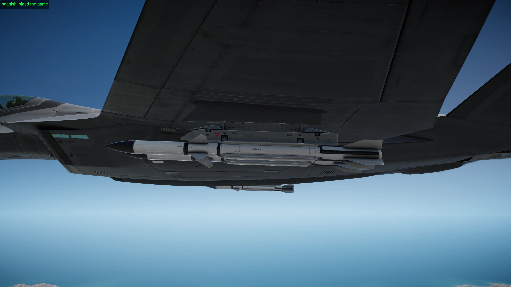
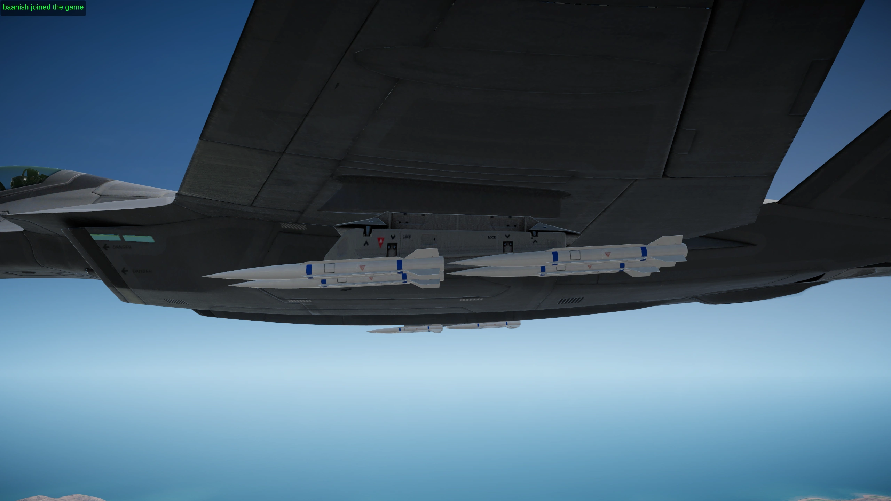

# SAAM-18 Karambit

Karambit is included in the baanish-armory 0.3.0 manual-install package with Eyeball-XL and Lance. Follow the [installation guide](INSTALL.md) for that combined release. Development builds retain the separate `baanish-karambit-prototype0.1.0` bundle identity and use the same custom guidance DLL. The local mission and prototype installer below are development tools, not a second installation required by the release.

The Karambit is a small radar missile for intercepting cruise missiles. Its model follows the supplied Peregrine references: a slender body, rounded ogive nose, four long strakes, compact diagonal tail fins and a recessed nozzle. It is 1.814801 m long with a 120 mm body, retaining the prototype's half-Scythe length and fitting inside its carriage envelope. The surface uses the stock Scythe's Weapons4 material and texture atlas, with service hatches and warning markings at the stock texture scale. Recessed section joints, blended fin roots with screw markings, and a stepped nozzle with internal ribs add mechanical detail. The two blue bands are matte, nonmetallic paint using the stock shader, albedo and occlusion; the HUD has a matching outline icon.

Its nominal launch envelope is 12 nautical miles, exactly 22,224 m. That setting is not a measured flight range. The starting motor and aerodynamic values come from the [concept](KARAMBIT-CONCEPT.md).

The same Ifrit launcher lanes with stock Scythes and tandem Karambits:

| Stock Scythe ×2 | Karambit ×4 |
| --- | --- |
|  |  |

## Play the saved interception

After generating and installing the mission below, enable Blueprinter 2.0.1 and Karambit, then choose **SAAM-18 Karambit - Ignus Interception** in the custom mission list.

You start in an Ifrit at 2,000 ft, 609.6 m, over the western Ignus sea, carrying 20 Karambits and four stock Scythes. Two mirrored two-Scythe racks provide a visual reference alongside the Karambit racks. Twenty Boscali AShM-300s approach from 13 nautical miles ahead, 24,076 m, aimed at a friendly patrol boat 6 km behind you. They spawn already flying toward the boat. The prototype initializes this named test salvo at the stock missile's calculated cruise speed, with its fins, motor and guidance active. A one-time shared track at three seconds provides the initial cue; the missile extrapolates that cue when the aircraft loses tracking.

A friendly Medusa starts 5 km west and 2 km behind you at 750 m, with a radome sharing contacts through Primeva's datalink. It carries two ARAD-116s and follows a persistent native waypoint over the sea. The incoming optical missiles have no radar emission for the ARADs to attack.

Select the incoming missile tracks, choose SAAM-18, and fire. Restart Mission restores the aircraft, ammunition and salvo. The patrol boat has short-range gun defenses.

The mission uses native saved missiles and timed objectives. It works without the agentic framework running. It requires the prototype plugin for the test salvo's immediate cruise state and the Karambit's custom seeker.

## Play the stock mission with Karambits

Choose **SAAM-18 Karambit - Cruise Missile Interception** in the custom mission list. This copies the stock **04. Cruise Missile Interception** mission from Nuclear Option 0.34.2, with the Revoker's cannon and 20 Karambits. Eight rounds occupy its mirrored internal bays and twelve occupy its wing pylons, in two six-round racks based on the stock three-Scythe mount. Its wingtips retain two stock Scythes and cannot carry Karambits.

The Revoker starts on the ground at North Boscali Airbase in Heartland. Two Primeva Darkreaches carry eight ALND-4 nuclear cruise missiles between them and launch through the stock AI. The original weather, defenders, enemy loadouts, objectives, return-to-base marker and victory conditions remain intact. This copy uses the normal aircraft radar and ground radar network.

With Karambit already installed, generate and install this separate mission from a local export of the stock mission TextAsset:

```powershell
./scripts/New-KarambitStockMission.ps1 -Install
```

The default source is `.local/karambit-mission/stock-cruise-interception.mission.json`. Pass `-Template` to select another export of **04. Cruise Missile Interception**. The generator verifies the reviewed stock payload and checks that only the description and player's loadout change. Source and generated stock mission data stay under `.local`; the game assets are not distributed with the repository. `-CheckOnly` verifies the generated files. Installation preserves an existing identical copy and refuses to replace different content.

## Build and install locally

Use the existing Unity 2022.3.62f2 project with the Nuclear Option 0.34.2 assemblies and imported Blueprinter placeholders prepared as described in [the build guide](BUILD.md). You also need the .NET SDK and a local NO Agentic Framework checkout for the mission generator's native template. Python 3 with Pillow is required only when authoring the model and HUD icon.

From the repository root in PowerShell 7:

```powershell
./scripts/Build-Karambit.ps1
./scripts/New-KarambitMission.ps1 -Template 'X:/NO-Agentic-Framework/templates/airborne.mission.json'
./scripts/Install-Karambit.ps1
```

The default build validates and builds the committed assets, then writes the runtime DLL, separate Karambit bundle and checksums under `.local/karambit-build`. After changing the shape, art or stats, run `./scripts/Build-Karambit.ps1 -AuthorAssets`. This generates the model from `art/source/karambit/build_karambit.py` and authors the Unity assets before building. Editable OBJ geometry, Unity mesh JSON and the model's measurements are written under `.local/karambit-art`. Review and commit those asset changes before release packaging.

The development installer adds `BepInEx/plugins/baanish-karambit-prototype`, enables an installed Blueprinter 2.0.1 if it is disabled, and copies the mission into the game's native mission directory. Do not install that folder alongside the combined 0.3.0 release, which already contains the Karambit bundle and runtime. Use [release packaging](BUILD.md#prepare-local-release-packages) to combine both builds into one plugin folder.

For runtime changes, use `Build-Karambit.ps1 -RuntimeOnly` to reuse the verified bundle. Close the game, regenerate the mission if it changed, then use `Install-Karambit.ps1 -Update`. Updates verify the previous installation receipt and back up the installed prototype and mission under `.local/karambit-backups` before replacing their files.

Pass `-GameDir` and `-UnityPath` to the build script for other installations. The mission generator requires `-Template` with a native JsonVersion 6 airborne Ifrit template, such as a framework checkout's `templates/airborne.mission.json`. It generates local files and reports the intended game destination without installing them. Pass `-MissionRoot` to report another mission directory, and pass the same directory to `Install-Karambit.ps1` when installing. The default is the current user's `AppData/LocalLow/Shockfront/NuclearOption/Missions` directory.

## Model budget

The authored mesh has 2,096 triangles and 2,814 vertices, with two material slots. The exporter reuses identical position, normal and UV tuples while preserving hard edges and atlas seams. It rejects geometry above 2,106 triangles, three times the stock Scythe's triangle count, and requires 16-bit indices. The shared mesh is reused by mounted and launched rounds.

These counts come from the installed Nuclear Option 0.34.2 projectile meshes, including their fins and wings, excluding particles and launch pylons:

| Missile | Triangles | Material slots |
|---|---:|---:|
| IRM-S2 | 472 | 1 |
| MMR-S3 | 608 | 1 |
| AAM-29 Scythe | 702 | 1 |
| ALM-C450 | 1,158 | 5 |
| AShM-300, cruising | 1,948 | 7 |
| AShM-300, booster attached | 2,330 | 8 |
| SAAM-18 Karambit | 2,096 | 2 |

The 16-sided body and eight ogive stations retain smooth normals. The blue paint uses the second slot, adding a draw submission per applicable rendering pass. Triangle counts alone do not establish frame-rate cost.

An uncapped 2560×1440 underwing test on the development PC measured 2.14 ms mean frame time with the mounted Karambit meshes visible and 2.11 ms with them hidden, a 0.03 ms difference. Eight interleaved two-second slices retained the aircraft, pylons, four Scythes, physics and guidance. Twenty mounted Karambit renderers were toggled, including eight external rounds; closed internal bays limit their visible cost. This test used the earlier rack geometry and measures missile drawing in that scene. It does not measure the revised rails, total mod cost or performance on other hardware.

The blended roots reduce the jagged contact shading seen on the thin original attachments. Some close-angle artifacts remain with the game's half-resolution screen-space ambient occlusion. The prototype uses the stock renderer settings.

## Flight and carriage

See [the seeker explainer](KARAMBIT-SEEKER.md) for a comparison with the stock Scythe's targeting and guidance.

The seeker prefers the designated track when it is a detectable enemy airborne radar return within 1.5 km of the cue. It uses the strongest qualifying return as a fallback, then returns to the designation if it becomes detectable again. This lets separately designated shots stay on their chosen tracks. Ships, ground units, neutral units and friendlies cannot become seeker targets. Jam tolerance is 0.60, below the Scythe's 0.85, with no home-on-jam.

The [upward radar field](../art/references/karambit-upward-radar-sketch.png) follows the missile's nose. Its inclusive elevation limits are ten degrees down and sixty degrees up, with sixty degrees to either side. Acquisition, continued tracking and jammer reception use this field. A target below its lower edge cannot supply a radar return; a remembered lock can persist for four seconds. Terrain line of sight, radar horizon and ground clutter still apply.

Low surface missiles below 1,000 ft radar altitude, 304.8 m above the surface, select the ground profile. Aircraft, anti-air missiles and ballistic missiles always select air interception, as do targets climbing at least 5° and 5 m/s. Other targets at or above the altitude boundary retain air lead. Air guidance preserves the target's vertical velocity instead of flattening its intercept aimpoint.

The ground profile's cruise altitude goal is the greater of 10 ft, 3.048 m, above the terrain or sea and 20 m beneath the target's known altitude. The floor sits below the stock 6-12 m sea-skimmers. A turn-radius controller commands descent and leveling within the authored turn and g limits, with bounded altitude trim to remove steady aerodynamic bias.

Terrain avoidance follows the ALM-C450's six-second lookahead, ten-degree heading preview, vertical ground probes and static/exclusion-zone collision masks. Karambit also samples the route at intervals no greater than 500 m and probes its predicted turn-limited descent in quarter-second segments. This catches narrow obstacles between the ground samples. Rising terrain raises the altitude goal; the short guidance waypoint retains a fast descent over open water. Inside 1.25 km slant range, terminal guidance pursues the target directly while retaining an obstruction safety override. It remains terminal for that lock. Lock persistence is four seconds.

External mounted rounds point five degrees nose-down relative to the aircraft. Their tandem lanes follow that incline, placing the rear round higher and the front round lower as in the [rack sketch](../art/references/karambit-angled-rack-sketch.png). Each lane uses a narrowed stock Scythe rail. Two- and three-lane racks retain their native tapered adapter beneath the aircraft pylon. Each rail's front and rear ends align with the corresponding missile centers of mass, and the equal-mass pair balances beneath the hardpoint. The attachment uses the missile's automatic capsule center of mass, including its root offset. External attachment compensates for the stock hardpoints' pitch and roll, so a wingtip cannot turn that pitch into yaw.

Internal rounds retain the stock bay rails' orientation and compact tandem centers. Tilting stored rounds raises their rear fins into bay hardware. After the native rail traversal finishes, the free missile spawns five degrees nose-down relative to the aircraft. Stock rail travel, inherited velocity, door and ejection timing remain intact, and the launch rotation is included in the native network spawn state.

| Aircraft | Internal rounds | External rounds | Total |
|---|---:|---:|---:|
| Revoker | 8 | 12 | 20 |
| Vortex | 8 | 12 | 20 |
| Ifrit | 12 | 16 | 28 |

Internal mounts add no drag or radar cross-section. External four-round racks use drag 0.35 loaded and 0.12 empty, with RCS 0.06 loaded and 0.03 empty. The two-round rack uses half those penalties; the six-round rack uses 1.5 times them. These are deliberate prototype balance settings. Revoker wing pylons carry the six-round variant, with no Karambit wingtip option. The Vortex underwing stations and the Ifrit's two external station sets offer two- and four-round variants. Vortex wingtips carry the two-round variant. Alternative rack choices do not add together when calculating aircraft capacity.

The motor targets 900 m/s of ideal delta-v, split into 300 m/s from the two-second booster and 600 m/s from the six-second sustainer. Propellant uses the stock Scythe's effective exhaust speeds of 2,000 and 2,800 m/s. Retaining 43.75 kg of dry hardware gives 8.772262 kg of booster fuel, 10.455226 kg of sustainer fuel and 62.97749 kg launch mass. Thrust is 8.772262 kN and 4.8791055 kN respectively. Asset validation pins the stage allocations, total, dry mass, exhaust speeds and loaded rack masses. Drag, steering and the speed cutoff reduce delivered flight performance.

Native motor thrust stops at Mach 2.5 using the local speed of sound. Fuel continues burning through the cutoff, and gravity can produce transient overspeed in a dive. Stock aerodynamic curves remain intact. Turn rate is 10°/s, G limit 15 and fin area 0.15. Blast yield remains 8 and price $500,000. The stock prelaunch range calculation ignores motor speed cutoffs, so its estimate can be optimistic; the 12 nm nominal envelope is not a measured guarantee.

The mounts arrange half-length rounds inside the stock mounts' longitudinal envelope. The table gives each aircraft's all-Karambit capacity; the saved comparison mission uses 20 Karambits and four Scythes.

## Carriage inspection

External racks preserve the stock Scythe rails' texture coordinates, triangle indices and material. Rail width and contact surfaces are adapted to the smaller tandem bodies. Each rail contacts both bodies at their centres of mass, with 2–6 mm overlap and at least 3 mm of clearance from the rendered fins. Support geometry uses 648 triangles for the two-round rack, 1,912 for the four-round rack and 2,560 for the six-round rack. The latter two include their unchanged 616-triangle stock adapter. These equal the corresponding native Scythe rack budgets.

Stock internal mounting orientation gives 29.7 mm rear-fin clearance from the identified Revoker bay rib, 67.9 mm from the Vortex engine and 23.8 mm from the Ifrit outer-lane fuselage surface. The Vortex needs no rear-seat displacement. These static measurements cover the identified tilt-induced fin collisions; other bay hardware still needs visual inspection.

The [Scythe and Karambit launcher comparison](https://iris.baanish.com/baanish-armory/karambit-racks.html) contains 48 in-game 2560 × 1440 photographs: Revoker, Vortex and Ifrit, single and double launcher lanes, each from front, rear, side and underside. Single lanes compare one Scythe with two Karambits; double lanes compare two with four. These Revoker views predate its six-round wing rack. Each pair uses the same left underwing station, with actual camera position and aim matching within 20 mm and orientation within 0.1°. Exposed fixtures and body/rail contacts look connected; mating faces hidden by the bodies remain unverified. The six-round rack still needs an in-game inspection.

Separate ground checks captured eight views per aircraft with settled wheel support, native closed bay doors and intact stores. Minimum external missile-mesh vertical clearance above the sampled ground was 1.107 m for Revoker, 1.106 m for Vortex and 1.248 m for Ifrit. The Revoker measurement predates its six-round rack and does not establish that rack's ground clearance. These measure the settled stance, not the taxi or landing envelope. A full audit of every internal mating surface remains incomplete.

## Agentic checks

The 900 m/s motor allocation and 62.97749 kg launch mass passed manual single-player playtesting. The reported automated flight checks below apply to earlier motor balances. They do not validate the current motor allocation, kill rate or cost per kill. Multiplayer remains untested.

The four-round external rack build passed the full 20-round salvo scenario: 20 unique launches against 20 selected inbound tracks, all 20 original targets removed and ammunition exhausted. The comparison captures and all three ground cases also passed their framework gates, and temporary missions and player settings were restored after the runs. These runs do not validate the Revoker's six-round rack.

The scenarios under `tests/agentic` load only the framework, Blueprinter and this prototype into a temporary game profile. From the repository root:

```powershell
& 'E:/Development/NO-Agentic-Framework/.cache/tools/no-agentic.exe' lint tests/agentic/karambit.scenario.jsonc --game-dir 'D:/SteamLibrary/steamapps/common/Nuclear Option'
& 'E:/Development/NO-Agentic-Framework/.cache/tools/no-agentic.exe' run tests/agentic/karambit.scenario.jsonc --game-dir 'D:/SteamLibrary/steamapps/common/Nuclear Option' --digest
& 'E:/Development/NO-Agentic-Framework/.cache/tools/no-agentic.exe' run tests/agentic/karambit-intercept.scenario.jsonc --game-dir 'D:/SteamLibrary/steamapps/common/Nuclear Option' --digest
```

The interception check correlates the fired Karambit's ID, its designated and locked target IDs, and that AShM-300's disappearance from complete truth snapshots within 0.5 seconds of the interceptor's end. It also requires compatible final separation. The evidence allowance is 20 m plus 1,500 m/s of combined closure during the last sample's age, up to 0.5 seconds. This conservative test allowance can reject sparse telemetry; it is not a weapon damage radius. The framework's generic `hit` classification alone does not prove destruction. The scenario also checks continued tracking after the one-time cue expires and that the Medusa stays airborne past its idle landing timer.

On Nuclear Option 0.34.2, the rebalanced Mach 2.5 missile's single-shot scenario destroyed its designated AShM-300 after launch just inside 12 nm. It measured a sustained 3.11–3.78 m cruise altitude below the target, with the 3.048 m setpoint and five-degree launch. Peak sampled speed was Mach 2.51. Focused live checks also confirmed radar-guided and infrared SAM interception, low-SAM air guidance, and a terminal Piledriver interception from a 30-degree nose-up aircraft with a 25-degree world launch angle. Low and high aircraft retained designated radar locks and the air profile. Run evidence stays local under `.agentic/runs`. These checks do not establish cost per kill, aircraft balance or multiplayer compatibility.

The full-salvo test selects all twenty incoming tracks through the game's HUD, then fires one continuous burst through its native salvo routine. Its separate mission carries exactly twenty Karambits and omits the comparison Scythes. Build the test-only selector and generate the derivative fixture with:

```powershell
./scripts/New-KarambitSalvoTest.ps1 -BuildHelper -GameDir 'D:/SteamLibrary/steamapps/common/Nuclear Option'
& 'E:/Development/NO-Agentic-Framework/.cache/tools/no-agentic.exe' run tests/agentic/karambit-salvo.scenario.jsonc --game-dir 'D:/SteamLibrary/steamapps/common/Nuclear Option' --digest
```

The result counts the original incoming missile IDs in a complete final truth snapshot, with all twenty interceptor end events accounted for. Each disappearance window must contain a compatible interceptor end after that target's last sighting. Targets observed after every interceptor has ended cannot pass. It measures before the patrol boat's defenses can affect the salvo. The selector is loaded only into this automated test profile.

With the rebalanced Mach 2.5 motor and upward radar field, the full-salvo scenario passed: twenty distinct selected tracks received twenty Karambits, all twenty incoming missiles were destroyed, and ammunition reached zero. Every launch measured five degrees nose-down. The conservative missile-to-boat distance bound stayed above 19.8 km, excluding the boat's defenses from the result. The burst also released every round from both loaded external four-round racks.

The result checker also has twenty-five fixtures covering surviving missiles, duplicate launch IDs, missing end events, capped truth lists, the boat-distance boundary, every round's five-degree launch attitude, post-end target survival and incompatible final separation:

```powershell
dotnet run --project tests/KarambitSalvoChecks/KarambitSalvoChecks.csproj -c Release -p:FrameworkDir=E:/Development/NO-Agentic-Framework
```

The terrain scenarios add either an isolated 90 m Unity terrain ridge or a 320 m static obstacle only 25 m thick across the interception path. Both require positive measured clearance, a live crossing and subsequent destruction of the designated target:

```powershell
./scripts/New-KarambitSalvoTest.ps1 -BuildHelper -GameDir 'D:/SteamLibrary/steamapps/common/Nuclear Option'
& 'E:/Development/NO-Agentic-Framework/.cache/tools/no-agentic.exe' run tests/agentic/karambit-terrain.scenario.jsonc --game-dir 'D:/SteamLibrary/steamapps/common/Nuclear Option' --digest
& 'E:/Development/NO-Agentic-Framework/.cache/tools/no-agentic.exe' run tests/agentic/karambit-terrain-narrow.scenario.jsonc --game-dir 'D:/SteamLibrary/steamapps/common/Nuclear Option' --digest
```

The rebalanced Mach 2.5 missile crossed the 320 m narrow obstacle with at least 8.89 m physical clearance and then destroyed its designated target. The broad-ridge scenario has not been repeated with this motor balance. These fixtures are created only in their terrain test profiles and are absent from the saved playtest mission.

To share control with the agent, use `launch` with physical input enabled:

```powershell
& 'E:/Development/NO-Agentic-Framework/.cache/tools/no-agentic.exe' launch tests/agentic/karambit.scenario.jsonc --game-dir 'D:/SteamLibrary/steamapps/common/Nuclear Option' --input --show --resolution 2560x1440
```

The agent can read telemetry and send commands while you fly. Avoid scripted `run` during manual flight because it locks physical controls. `no-agentic stop` ends the shared session and restores the temporary profile. An idle session exits after ten minutes without an agent command.
